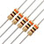

[Return Home](https://yanray.github.io/Black_Hat_Cats/)

**Notes**(Coding Download will be available after final competition)

# Lab 1: Microcontroller

### Objective
  •Learn basics of Arduino io by controlling LEDs and motors

  •Assemble basic body for a robot and use the Arduino to move in a basic square

### Teams
**subteam 1**: Hadi Alzayer, Alberto Lopez Delgado

**subteam 2**: Yanrui Wang , Ian Switzer

## Step 1: Pre-lab work

[Click here](https://www.arduino.cc/en/Main/Software) to download Arduino IDE.

After install Arduino IDE, you will see this.


## Step 2: Internal LED Blink

**Firstly**, Open Ardunio IDE -> File -> Examples -> 1.Basics -> Blink

**Then**, Click **Checkmark** to compile code -> Click **right arrow** to upload your code to Arduino

**Luckily**, The Internal LED blinks, see the video below.

***Warning!!***  Make sure your Arduino IDE is connected to right COM port. Click Tools -> Serial Port list to see.

<iframe width="560" height="315" src="https://www.youtube.com/embed/iQ6RLm8GsXc" frameborder="0" allow="autoplay; encrypted-media" allowfullscreen></iframe>

*[Coding for Step2]*

``` c++
// the setup function runs once when you press reset or power the    board
void setup() {
  // initialize digital pin LED_BUILTIN as an output.
  pinMode(LED_BUILTIN, OUTPUT);
}

// the loop function runs over and over again forever
void loop() {
  digitalWrite(LED_BUILTIN, HIGH);   // turn the LED on (HIGH is the voltage level)
  delay(1000);                       // wait for a second
  digitalWrite(LED_BUILTIN, LOW);    // turn the LED off by making   the voltage LOW
  delay(1000);                       // wait for a second
}
```

## Step 3: External LED Blink

After Internal LED Blink, Let us Blink an External LED ! 

Pick up a LED  and a Resistor. 

**Then**, Connect LED and Resistor on breadboard, use a different Pin and modify code to blink Internal LED. 

**Great!**, The External LED blinks, see the video below.

***Warning!!***  Make sure your LED is connected to a Resistor at least 300ohm. Unless you want to blow up your Arduino. 

<iframe width="560" height="315" src="https://www.youtube.com/embed/0pE7rAklaJY" frameborder="0" allow="autoplay; encrypted-media" allowfullscreen></iframe>

*[Coding for Step3]*

```c++
// the setup function runs once when you press reset or power the    board
int led_pin = 10; //pin connected to external LED
void setup() {
  // initialize digital pin LED_BUILTIN as an output.
  pinMode(led_pin, OUTPUT);
}

// the loop function runs over and over again forever
void loop() {
  digitalWrite(led_pin, HIGH);   // turn the LED on (HIGH is the voltage level)
  delay(1000);                       // wait for a second
  digitalWrite(led_pin, LOW);    // turn the LED off by making   the voltage LOW
  delay(1000);                       // wait for a second
}
```

## Step 4: Read the potentiometer 

After External LED Blink, Let us Read Analog value of Potentiometer ! 

Pick up a Potentiometer and a Resistor.

**Then**, Connect Potentiometer and Resistor on breadboard, use the Analog Pin A0 and write code to read the value. 

Remember click **Serial monitor** to see the value. (on the top right of Arduino IDE)

**Cool !**, Get the value of Potentiometer, see the video below.

***Warning!!***  Make sure your Potentiometer is connected to a Resistor at least 300ohm. Unless you want to blow up your Arduino. 

<iframe width="560" height="315" src="https://www.youtube.com/embed/qJ6spCfECX0" frameborder="0" allow="autoplay; encrypted-media" allowfullscreen></iframe>

*[Coding for Step4]*

```c++
int analog_pin = A0;

void setup() {
  // initialize serial communication at 9600 bits per second:
  Serial.begin(9600);
}

void loop() {
  // read the input pin:
  value_analogRead = analogRead(analog_pin);
  Serial.println(Value_analogRead);
  delay(10);        // delay in between reads for stability
}
```

## Step 5: Analog Output (PWM)

In this step, we connect **Step 3** and **Step 4** to read the value of potentiometer and put the output to External LED. 

***Note *** You could learn PWM [Click here](https://cei-lab.github.io/ece3400-2017/tutorials/PWM/PWM.html).

<iframe width="560" height="315" src="https://www.youtube.com/embed/FzOQpxXkZDM" frameborder="0" allow="autoplay; encrypted-media" allowfullscreen></iframe>

*[Coding for Step5]*
```c++
#include <Servo.h>
int MAX_READING = 1023;
int analog_pin = A0;
int led_pin = 11;

void start_now() {
  Serial.begin(9600);
  pinMode(analog_pin, INPUT);
  pinMode(led_pin, OUTPUT);
}
void setup() {
  start_now();
}
void loop() {
  int value_analogRead = analogRead(analog_pin);
  Serial.print(value_analogRead*5.0/MAX_READING);
  Serial.println(" Volts");
  output_to_led(value_analogRead);
}
void output_to_led(int value) {
  int new_value=map(value,0,MAX_READING,0,255);
  analogWrite(led_pin,new_value);
}
```

## Step 6: Parallax Servos 

Pick up a Parallax Servo     
**Reminder** *Red Line = Vcc, Black Line = GND, White Line = Signal*

Unlike a regular servo that is usually limited to 180 degrees and control the angle, a continuous servo (like the one used for this lab) can be controlled with direction and speed. 

Click File -> Examples -> Servo -> knop   to open your demo coding.  
**Then** we connect our previous coding with Servo. To make Servo move, we connect **Step 3**, **Step 4**, **Step 5**.
See the video below.


<iframe width="560" height="315" src="https://www.youtube.com/embed/gK3PRNAZcIo" frameborder="0" allow="autoplay; encrypted-media" allowfullscreen></iframe>

*[Coding for Step6]*

```c++
#include <Servo.h>
int MAX_READING = 1023;
int analog_pin = A0;
int led_pin = 11;
int Servo_pin = 5;
Servo MyServo;

void start_now() {
  Serial.begin(9600);
  pinMode(analog_pin, INPUT);
  pinMode(led_pin, OUTPUT);
  MyServo.attach(Servo_pin);
}
void setup() {
  start_now();
}
void loop() {
  int value_analogRead = analogRead(analog_pin);
  Serial.print(value_analogRead*5.0/MAX_READING);
  Serial.println(" Volts");
  output_to_led(value_analogRead);
  move_motor(MyServo, value_analogRead);
}
void output_to_led(int value) {
  int new_value=map(value,0,MAX_READING,0,255);
  analogWrite(led_pin,new_value);
}
void move_motor(Servo motor, int value){
  int new_value=map(value,0,MAX_READING,0,255);
  motor.write(new_value);
}

```

## Step 7: Assemble Impressive Robot 

To assemble the robot, we looked at previous designs and decided the cleanest design with the parts available. We chose a laser-cut plexiglass with a breadboard glued to it, to facilitate the connections with the Arduino.


 
Next, we attached the servo mounts and the servos themselves. We tried using the 3D-printed battery holders, but they were too large for the battery and didn’t provide the sturdiness we expected. In turn, we temporarily used a zip-tie.
 
 

We assembled the wheels to the servos with no issues. However, the ball bearing was too short, so we had to use the plastic extension shown in the picture. We are going to 3D-print a new ball bearing, because the extension causes undesirable wiggling that could lead to instability and malfunctions later in the project.
 
We next mounted the Arduino (partially on top of the breadboard) and used 2 plastic extensions, nuts and bolts to provide the desired stability, as shown below.


## Step 8: Make the Robot Go !

Now using what we have done to run the motors, we can use it to control two motors to move in a square. 

**Reminder**  Understand how to make servos move forward and backward in different velocity. 

<iframe width="560" height="315" src="https://www.youtube.com/embed/J6l1jtC9Hv0" frameborder="0" allow="autoplay; encrypted-media" allowfullscreen></iframe>

*[Coding for Step8]*

``` c++
 #include <Servo.h>
int MAX_READING = 1023;
int analog_pin = A0;
int led_pin = 11;
int leftServo_pin = 5;
int rightServo_pin = 6;
Servo leftServo;
Servo rightServo;

void start_now() {
  Serial.begin(9600);
  pinMode(analog_pin, INPUT);
  pinMode(led_pin, OUTPUT);
  leftServo.attach(leftServo_pin);
  rightServo.attach(rightServo_pin); //check pin
}
void setup() {
  start_now();
}
void loop() {
  int motor_value = 180;
  move_motor(leftServo, 180);
  move_motor(rightServo, 180);
  delay(635);
  move_forward();
  delay(1000);
}
void output_to_led(int value) {
  int new_value=map(value,0,MAX_READING,0,255); //scale to PWM range
  analogWrite(led_pin,new_value);
}
void move_motor(Servo motor, int value){
  motor.write(value);
}
void move_forward(){
  move_motor(leftServo, 0);
  move_motor(rightServo,180);
}
```

## Extra step: 

### If you want to make more things in lab. The following would be a great reference. 

The modification I added since we had extra time was a basic microphone circuit. This was done before realizing this is very similar to the next lab. Regardless, I guess we are ahead of the game.


The way the circuit works is as follows. The signal starts at the microphone. One leg of the microphone is pulled up to 5 volts through a resistor, the other is set to ground. When sound hits the microphone the microphone alternates the voltage on its pulled up leg as a direct representation of the sound. I then isolate the AC component  by passing it through a capacitor. This signal then goes to the noninverting side of an LM358 op amp. In this case we use a 25k resistor and a 50 ohm resistor to amplify by a factor of 501.

If we left it like this we would have a detectable signal. Unfortunately this signal would vary between about +-2.5 volts, so we add a dc offset through two 1k resistors to the noninverting input of the op amp. I also added a capacitor in line with the 50 ohms resistor to make it so the dc offset is not amplified. I then fed this signal to the analog input of the Arduino Uno. This signal is sampled at a rate of 9.5kHz until 128 samples are collected. The way I have it currently setup it can easily detect a signal anywhere between 100hz and 4.25khz. I had to “detach” the servos while sampling or else the PWM interrupts would interfere with sampling.

<iframe width="560" height="315" src="https://www.youtube.com/embed/ufud2p73alA" frameborder="0" allow="autoplay; encrypted-media" allowfullscreen></iframe>

From there frequency of the whistle is used to control whether the robot is moving straight, turning, or stopped, depending on how high the frequency is.

*[Coding for extra Step]*
``` c++
// ECE 3400 Fall 2018
// Team 13
// Lab 1
// Ian Switzer, Alberto Lopez Delgado, Yanrui Wang, Hadi Alzayer
#include "arduinoFFT.h"
arduinoFFT FFT = arduinoFFT();
#include <Servo.h>
Servo leftServo;
Servo rightServo;
#define CHANNEL A0
const uint16_t samples = 128;
const double samplingFrequency = 9000; //sample rate

unsigned int sampling_period_us;
unsigned long microseconds;
double vReal[samples];
double vImag[samples];

#define SCL_INDEX 0x00
#define SCL_TIME 0x01
#define SCL_FREQUENCY 0x02
#define SCL_PLOT 0x03

void setup()
{
  int leftServo_pin = 5;
  int rightServo_pin = 6;
  sampling_period_us = round(1000000 * (1.0 / samplingFrequency));
  Serial.begin(115200);
}

void loop()
{
  leftServo.detach(); //Detach the servos so that the PPM interrupt doesnt interfere with sampling
  rightServo.detach();
  delay(30);
  for (int i = 0; i < samples; i++)
  {
    microseconds = micros();
    vReal[i] = analogRead(A0);
    vImag[i] = 0;
    while (micros() < (microseconds + sampling_period_us)) {
    }
  }
  leftServo.attach(9); //reattach the servos
  rightServo.attach(10);
  FFT.Windowing(vReal, samples, FFT_WIN_TYP_HAMMING, FFT_FORWARD);  //Weigh data
  FFT.Compute(vReal, vImag, samples, FFT_FORWARD); //Compute FFT 
  FFT.ComplexToMagnitude(vReal, vImag, samples); //Compute magnitudes 
  delay(10);
  double f = FFT.MajorPeak(vReal, samples, samplingFrequency); //find the dominant frequency
  int mag = vReal[(int)(f * samples / samplingFrequency)]; //find the magnitude of dominant frequency
  if (mag > 300) { // filter out lower volume frequencies. That way someone talking won't make it turn right 
    if (f < 1300) {
      turn_right();   // if whistle frequecny is lower than 1300 hz, turn right
    }
    else if (f > 1900) { //if whistle frequency is higher than 1900 hz, turn left
      turn_left();
    }
    else {   // if whistle frequency is somehwere in between, go straight
      go_forward();
    }
  }
  else { //if there is no whistle, stop
    stop_now();
  }
  delay(20);
}

void move_motor(Servo motor, int value) {
  motor.write(value);
}
void go_forward() {
  move_motor(leftServo, 0);
  move_motor(rightServo, 180);
}


void turn_right() {
  move_motor(leftServo, 180);
  move_motor(rightServo, 180);
}

void turn_left() {
  move_motor(leftServo, 0);
  move_motor(rightServo, 0);
}

void stop_now() {
  move_motor(leftServo, 95);
  move_motor(rightServo, 90);
}
```


