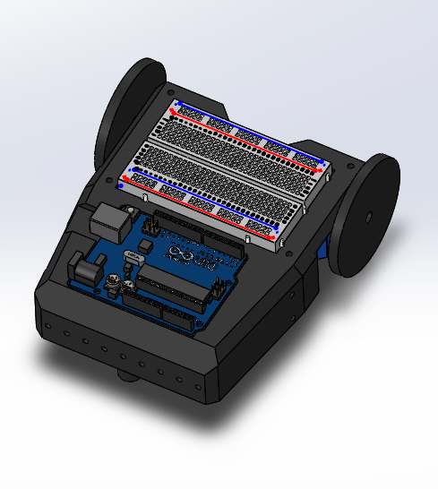
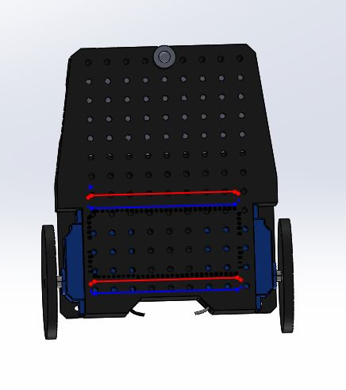

#### Lab 2

## Objectives
Design a microphone circuit that detects a 660Hz whistle blow signifying the beginning of maze mapping.
Design a circuit using an IR sensor to detect nearby robots emitting IR at 6.08kHz, and distinguish them from decoys emitting at 18kHz.

## FFT Library
The FFT library basically computes the fourier transform of the input signal and returns the magnitudes of each frequency with frequencies based on the sampling rate and sample size. We decided to use another FFT library that we have more experience with, called “arduinoFFT”.

## Robot Collision Avoidance and decoy detection

# IR sensors
The IR circuit is shown below. The IR sensor acts like a switch: it’s open (high resistance) when no IR light is received.


#IR Voltage with Oscilloscope
We measured the output voltage from our IR sensor with oscilloscope and viewed the FFT. The problem is that the robots IR oscillates at 6.08kHz fundamental frequency and its harmonics 12kHz, 18kHz, etc… . This is a problem because decoys also generate 18kHz light. So it might be hard to tell if decoy is there because it could be just a robot’s 18kHz frequency, but it’s much easier to tell if a robot is there because we can only check for the 6.08kHz oscillation. Note that if we can tell if a robot is there, we can just ignore the decoys and not react to them, and only stop when facing a robot. 

<iframe width="560" height="315" src="https://www.youtube.com/watch?v=QAz9nfZOm0I" frameborder="0" allow="autoplay; encrypted-media" allowfullscreen></iframe>

# Filtered IR signal
We decided to implement a RC low-pass filter with corner frequency slightly larger than 6.08kHz to detect the signal from the IR hat, filter out the decoys and account for some error. Ultimately we decided to find values of for a corner frequency of 7kHz. At first, we tried designing the filter with a fixed 100nF capacitor, which yielded a value of approximately 220Ω for the series resistor we needed to achieve the 7kHz frequency. We used the formula fc=1/(2πRC). However, these values didn’t filter out the 18kHz signal, so we decided to use a larger resistor (10kΩ), with a corresponding capacitor of approximately 2.2nF, which succeeded to filter the 18kHz decoy signal, and the harmonic components of the 6.08kHz IR hat. The filter was implemented as follows:

[insert pictures in Alberto’s pc]

## Amplification stage
The detection of the 6.08kHz signal and filtering of the 18kHz were successful, however the signals were noticeably different only at a short range of approximately 4 inches. Thus, we decided to design an amplification stage after the low pass filter, to detect the 6.08kHz signal at a greater distance. The amplification stage was designed as follows:

[insert picture of amplification circuit schematics]

With this implementation, the sensing ability of the circuit increased significantly, as observed in the amplitude of the signal in the picture below:

 

Since the Arduino can’t handle negative voltages, we had to make sure to include a positive voltage offset. The IR sensor added a DC offset on its own, but since we couldn’t control it, we decided to include a series capacitor to eliminate that offset, and use a voltage divider to control the voltage we wanted at the positive input of the amplifier. We introduced an offset of approximately 2.5V, hence making sure that the signal would never take values underneath 0V. 

[introduce video of serial monitor readings at a distance]
[also introduce screenshot of serial plots with different reading magnitudes at different distances]

Observe in the picture how the magnitude of the sensor readings of the 6.08kHz are significantly larger than the readings of the 16kHz at distances up to 9 inches. This ensures our little guy will detect other robots far enough that it will have time to avoid a collision.

## Time for Arduino to shine
We used an analog pin on the Arduino to read the output signal after the amplification stage, so that we can use the data to trigger when our robot detects an IR hat. The code was implemented as follows:

``` c++
#include "arduinoFFT.h"

arduinoFFT FFT = arduinoFFT(); /* Create FFT object */
/*
These values can be changed in order to evaluate the functions
*/
#define CHANNEL A0
const uint16_t samples = 128; //This value MUST ALWAYS be a power of 2
const double samplingFrequency = 40000; //Hz, must be less than 10000 due to ADC

unsigned int sampling_period_us;
unsigned long microseconds;

/*
These are the input and output vectors
Input vectors receive computed results from FFT
*/
double vReal[samples];
double vImag[samples];

#define SCL_INDEX 0x00
#define SCL_TIME 0x01
#define SCL_FREQUENCY 0x02
#define SCL_PLOT 0x03

#ifndef cbi
#define cbi(sfr, bit) (_SFR_BYTE(sfr) &= ~_BV(bit))
#endif
#ifndef sbi
#define sbi(sfr, bit) (_SFR_BYTE(sfr) |= _BV(bit))
#endif

void setup()
{
  sampling_period_us = round(1000000*(1.0/samplingFrequency));
  Serial.begin(115200);
  Serial.println("Ready");
  sbi(ADCSRA,ADPS2) ;
 cbi(ADCSRA,ADPS1) ;
 cbi(ADCSRA,ADPS0) ;
}

void loop()
{
  /*SAMPLING*/
  for(int i=0; i<samples; i++)
  {
      microseconds = micros();    //Overflows after around 70 minutes!

      vReal[i] = analogRead(CHANNEL);
      vImag[i] = 0;
      while(micros() < (microseconds + sampling_period_us)){
        //empty loop
      }
  }
  /* Print the results of the sampling according to time */
 
  FFT.Windowing(vReal, samples, FFT_WIN_TYP_HAMMING, FFT_FORWARD);	/* Weigh data */
  
  FFT.Compute(vReal, vImag, samples, FFT_FORWARD); /* Compute FFT */
 
  
  FFT.ComplexToMagnitude(vReal, vImag, samples); /* Compute magnitudes */
  
  double x = FFT.MajorPeak(vReal, samples, samplingFrequency);
  Serial.println(x, 6); //Print out what frequency is the most dominant.

  int mag = vReal[(int)(x * samples / samplingFrequency)]; //find the magnitude of dominant frequency

  Serial.println(mag);
  delay(200); /* Repeat after delay */
}

void PrintVector(double *vData, uint16_t bufferSize, uint8_t scaleType)
{
  for (uint16_t i = 0; i < bufferSize; i++)
  {
    double abscissa;
    /* Print abscissa value */
    switch (scaleType)
    {
      case SCL_INDEX:
        abscissa = (i * 1.0);
	break;
      case SCL_TIME:
        abscissa = ((i * 1.0) / samplingFrequency);
	break;
      case SCL_FREQUENCY:
        abscissa = ((i * 1.0 * samplingFrequency) / samples);
	break;
    }
    Serial.print(abscissa, 6);
    if(scaleType==SCL_FREQUENCY)
      Serial.print("Hz");
    Serial.print(" ");
    Serial.println(vData[i], 4);
  }
  Serial.println();
}
```

## 660Hz whistle blow detection
We designed and built the circuitry for this during lab 1. However, we didn’t set it to detect the 660Hz whistle blow. The FFT code was slightly modified to reflect the new threshold, as seen below:

``` c++
#include "arduinoFFT.h"
arduinoFFT FFT = arduinoFFT(); /* Create FFT object */
#define CHANNEL A0
const uint16_t samples = 128;
const double samplingFrequency = 4000; //sample rate

unsigned int sampling_period_us;
unsigned long microseconds;
double vReal[samples];
double vImag[samples];

#define SCL_INDEX 0x00
#define SCL_TIME 0x01
#define SCL_FREQUENCY 0x02
#define SCL_PLOT 0x03

double f;
int mag;
void setup()
{
  sampling_period_us = round(1000000 * (1.0 / samplingFrequency));
  Serial.begin(115200);
  Serial.println("Hello 2300");
}

void loop()
{
  sample();
  compute();
  if (mag > 1000&&f>670&&f<690) { //soft filter
    Serial.print("Freq: ");
    Serial.println(f, 6);
    Serial.print("Mag: ");
    Serial.println(mag);
  }
  else { 
    Serial.println("none");
  }
  delay(20);
}

void sample(){
  for (int i = 0; i < samples; i++)
  {
    microseconds = micros();
    vReal[i] = analogRead(A0);
    vImag[i] = 0;
    while (micros() < (microseconds + sampling_period_us)) {
    }
  } 
}

void compute(){
  FFT.Windowing(vReal, samples, FFT_WIN_TYP_HAMMING, FFT_FORWARD);  /* Weigh data */
  FFT.Compute(vReal, vImag, samples, FFT_FORWARD); /* Compute FFT */
  FFT.ComplexToMagnitude(vReal, vImag, samples); /* Compute magnitudes */
  f = FFT.MajorPeak(vReal, samples, samplingFrequency); //find the dominant frequency
  mag = vReal[(int)(f * samples / samplingFrequency)]; //find the magnitude of dominant frequency
}
```

The following video shows the detection of the 660Hz signal:
<iframe width="560" height="315" src="https://www.youtube.com/watch?v=Ig_-GFhcsrQ" frameborder="0" allow="autoplay; encrypted-media" allowfullscreen></iframe>

## New Mechanical Design!!




In order to improve the robustness of our robot we designed and used Ian’s 3D printer to make a custom robot frame. This design holds all of our components in place where we would want them and also allows for future flexibility through its many mounting points.


