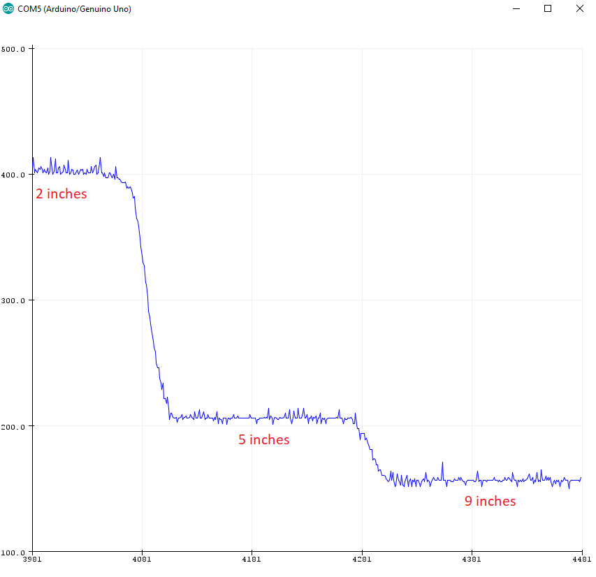

[Return Home](https://yanray.github.io/Black_Hat_Cats/)

# Milestone 2

## Objectives

* Traverse a maze using proximity sensors to detect walls (or absence thereof)
* Avoid collisions with other robots
* Prove that it does the previous tasks while performing line following.

## Wall Detection (with line following)

We used the provided SHARP IR sensors provided [seen here](20181017_211725.jpg). We proceeded to test the range of the sensors by connecting them to an analog input in the Arduino, and placing pieces of white cardboard in front of them. 

After checking the sensor worked properly, we proceeded to check the magnitude reading of the sensor at different distances, so that we could set a threshold. 



This graph allowed us to set an approximate threshold of magnitude 200. That is, when the robot gets to a corner, the threshold should be low enough that the reading of the sensors will exceed it if there is a wall, and trigger the appropriate action.

Two proximity sensors were used for wall-following. We placed one in the front and one in the right. We implemented the following logic to navigate the maze following the walls:

``` c++
when the robot is at a corner:
	if (there is a wall in the right && nothing in the front) go forward;
	if (there is a wall in the right && a wall in the front) turn left;
	if (there is no wall in the right) turn right;
```

We used an LED strip to display when the different sensors detect something. The videos show this more clearly. I.e.  when the robot detects a wall on its right, a green LED turns on; when it detects a corner, a red LED turns on; when it detects walls both in front and right, a different red LED turns on.

<iframe width="560" height="315" src="https://www.youtube.com/embed/0ifs3XyE3MU" frameborder="0" allow="autoplay; encrypted-media" allowfullscreen></iframe>

## Robot Detection and collision avoidance
The IR detection is thoroughly explained in [Lab 2](https://github.com/yanray/Black_Hat_Cats/docs/labs/phase_2/Phase2.md). We added code to signal when the robot has detected the IR hat (simulation of other robot, placed at approximately 5.5 inches above ground) using the LED strip, and instruct the robot to avoid the collision. In our case, we decided that the best course of action was to stop wherever it detects the IR signal, and resume motion once it doesn't detect it.

The portion of the code that takes care of this will be added to the following section.

<iframe width="560" height="315" src="https://www.youtube.com/embed/Xy4fxDyWPOU" frameborder="0" allow="autoplay; encrypted-media" allowfullscreen></iframe>

## It all comes together here

We put all the code together, buckled up, and here are the results:

<iframe width="560" height="315" src="https://www.youtube.com/embed/2fNGnOz1sxw" frameborder="0" allow="autoplay; encrypted-media" allowfullscreen></iframe>


### The Code
``` c++
#include <Servo.h>
#include "arduinoFFT.h"

arduinoFFT FFT = arduinoFFT();
#define CHANNEL A0
const uint16_t samples = 128; //This value MUST ALWAYS be a power of 2
const double samplingFrequency = 20000; //Hz, must be less than 10000 due to ADC

unsigned int sampling_period_us;
unsigned long microseconds;

#include <Adafruit_NeoPixel.h>
#ifdef __AVR__
#include <avr/power.h>
#endif

#define PIN 7
Adafruit_NeoPixel strip = Adafruit_NeoPixel(10, PIN, NEO_GRB + NEO_KHZ800);

#define SCL_INDEX 0x00
#define SCL_TIME 0x01
#define SCL_FREQUENCY 0x02
#define SCL_PLOT 0x03

#ifndef cbi
#define cbi(sfr, bit) (_SFR_BYTE(sfr) &= ~_BV(bit))
#endif
#ifndef sbi
#define sbi(sfr, bit) (_SFR_BYTE(sfr) |= _BV(bit))
#endif

double vReal[samples];
double vImag[samples];

int line_sens_pin[3] = {2, 3, 4};
long line_sens_data_time[3] = {0, 0, 0};
bool line_sens_data_digi[3] = {0, 0, 0};

#define STRAIGHT 0
#define RIGHT 1
#define LEFT  -1

int threshold = 250;
int counter = 0;
long corner_time = 0;

int turn_delay = 750;

bool front_wall;
bool right_wall;

bool enabled = true;
Servo leftServo;
Servo rightServo;
int leftServo_pin = 6;
int rightServo_pin = 5;

void setup() {
  sampling_period_us = round(1000000 * (1.0 / samplingFrequency));
  sbi(ADCSRA, ADPS2) ;
  cbi(ADCSRA, ADPS1) ;
  cbi(ADCSRA, ADPS0) ;
  Serial.begin(115200);
  enable_motor();
  strip.begin();
  strip.show();
}

void loop() {
  if (enabled) {
    for (int i = 0; i < 50; i++) {
      read_line();
      //print_visualizer();
      find_direction();
      start();
    }
  }
  else {
    stop_motors();

  }
  sample();
  int f = compute();
  int mag = vReal[(int)(f * samples / samplingFrequency)]; //find the magnitude of dominant frequency
  enabled = !(mag > 14000 && f > 6000 && f < 12000);
  Serial.print("f ");
  Serial.println(f);
  Serial.print("mag ");
  Serial.println(mag);

}

long readQD(int pin) {
  pinMode( pin, OUTPUT );
  digitalWrite( pin, HIGH );
  delayMicroseconds(10);
  pinMode(pin, INPUT);

  long time = micros();

  while (digitalRead(pin) == HIGH && ((micros() - time) < 3000));
  return (micros() - time);
}

void read_line() {
  for (int i = 0; i <= 2; i++) {
    line_sens_data_time[i] = readQD(line_sens_pin[i]);
    line_sens_data_digi[i] = (line_sens_data_time[i] < threshold);
  }
}

void print_visualizer() {
  for (int y = 0; y <= 3; y++) {
    Serial.print(line_sens_data_time[y]);
    Serial.print("  ");
  }
  Serial.println();

}

bool detect_corner() {
  return line_sens_data_digi[0] && line_sens_data_digi[1] && line_sens_data_digi[2]; //return center&&(left || right)
}

void start() {
  if (detect_corner()) {
    corner_detected();
  }
  else {
    follow_line();
    strip.setPixelColor(1, 0x0000FF);
    strip.show();
  }
}

int find_direction() {
  right_wall = analogRead(A5) > 175;
  front_wall = analogRead(A3) > 175;
  delay(2);
  // Serial.println(right_wall);

  // Serial.println(front_wall);

  if (!right_wall) {
    strip.setPixelColor(3, strip.Color(255, 0, 0));
    strip.show();

    return 1;
  }
  if (!front_wall && right_wall) {
    strip.setPixelColor(3, strip.Color(0, 255, 0));
    strip.show();
    return 0;
  }
  if (front_wall && right_wall) {
    strip.setPixelColor(3, strip.Color(0, 0, 255));
    strip.show();

    return -1;
  }
}

void follow_line() {
  int direct = detect_direction();
  if (direct != 0)slight_turn(direct)  ;
  else move_forward();
}

int detect_direction() {
  if (line_sens_data_digi[2]) {
    return 1;
  }
  else if (line_sens_data_digi[0]) {
    return -1;
  }
  else  if (line_sens_data_digi[1]) {
    return 0;
  }
}

void move_forward() {
  leftServo.write(180);
  rightServo.write(0);
}

void slight_turn(int direct) {
  if (direct == RIGHT) {
    leftServo.write(180);
    rightServo.write(87);
  } else {
    leftServo.write(95);
    rightServo.write(0);
  }
}

void turn(int direct) {
  if (direct == RIGHT) {
    leftServo.write(180);
    rightServo.write(180);
    delay(750);
    find_direction();
    if (!front_wall) {
      leftServo.write(180);
      rightServo.write(0);
      delay(200);
    }
  } else {
    leftServo.write(0);
    rightServo.write(0);
    delay(750);
    corner_detected();
  }
}

void sample() {
  disable_motor();
  for (int i = 0; i < samples; i++)
  {
    microseconds = micros();    //Overflows after around 70 minutes!

    vReal[i] = analogRead(CHANNEL);
    vImag[i] = 0;
    while (micros() < (microseconds + sampling_period_us)) {
      //empty loop
    }
  }
  enable_motor();
}


int compute() {
  FFT.Windowing(vReal, samples, FFT_WIN_TYP_HAMMING, FFT_FORWARD);  /* Weigh data */
  FFT.Compute(vReal, vImag, samples, FFT_FORWARD); /* Compute FFT */
  FFT.ComplexToMagnitude(vReal, vImag, samples); /* Compute magnitudes */
  int f = FFT.MajorPeak(vReal, samples, samplingFrequency);
  return (f);
}

void enable_motor() {
  leftServo.attach(leftServo_pin);
  rightServo.attach(rightServo_pin);
}

void disable_motor() {
  leftServo.detach();
  rightServo.detach();
  delay(30);
}

void stop_motors() {
  leftServo.write(90);
  rightServo.write(90);
  delay(10);
  for(int j=0; j<256*5; j+=10) { // 5 cycles of all colors on wheel
    for(int i=0; i< strip.numPixels(); i++) {
      strip.setPixelColor(i, Wheel(((i * 256 / strip.numPixels()) + j) & 255));
    }
    delay(10);
    strip.show();
}
delay(10);
    for(int i=0; i< strip.numPixels(); i++) {
      strip.setPixelColor(i, 0);
    }
}

void corner_detected() {
  find_direction();
  strip.setPixelColor(1, 0xFFFFFF);
  strip.show();
  int current_dir = find_direction();
  if (current_dir == 0)
  {
    move_forward();
  }
  else turn(current_dir);

}
uint32_t Wheel(byte WheelPos) {
  WheelPos = 255 - WheelPos;
  if(WheelPos < 85) {
    return strip.Color(255 - WheelPos * 3, 0, WheelPos * 3);
  }
  if(WheelPos < 170) {
    WheelPos -= 85;
    return strip.Color(0, WheelPos * 3, 255 - WheelPos * 3);
  }
  WheelPos -= 170;
  return strip.Color(WheelPos * 3, 255 - WheelPos * 3, 0);
}
```
